## HackTheBox Cyber Apocalypse CTF 2022 | Misc | Quantum Engine
##### Author: Sanduuz | Date: 18.05.2022

---

### Challenge details:
* Points: 400
* Solves: 20
* Difficulty: ★★☆☆
* Description:

> We need to travel to one of Draeger's lair in a galaxy far away from here, to search for any clues that might help us prove how Draeger manipulated her to be his most trustworthy cold-blooded assassin. However, traveling there can be quite difficult since it's flooded with the most state-of-the-art IFGs attack spacecrafts. Should we be able to outspeed them, we might have a chance of making it there in one piece. That is why we came to you. Word on the solar system is that you are one of the best quantum mechanics of the galaxy, which I find odd considering your age. Will you be able to modify Phalcon's acceleration system so no IFG spacecraft can ever catch us?
>
> Downloadable part: [misc_quantum_engine.zip](./attachments/misc_quantum_engine.zip)

Quantum Engine was an interesting challenge under the Misc category in HackTheBox Cyber Apocalypse CTF 2022. In this challenge we get to dive deep into (qu)bits.

> Note: It is possible (and even likely) that this writeup contains some errors regarding quantum theory/mechanics since I am not a professional in either of those subjects. The research is solely based on couple days worth of Googling. If you notice any errors, please correct me and I will fix it.

---

## Table of Contents
* [Writeup](#writeup)
    1. [Qubits and Gates](#1-step-one---qubits-and-gates)
        - [Theory](#theory)
        - [Example](#example)
            - [Hadamard](#hadamard)
            - [T](#t)
            - [Tdg](#tdg)
            - [CZ](#cz)
            - [CX](#cx)
    2. [Toffoli?](#2-step-two---toffoli)


---

## Writeup:

**TL;DR**
**Create a quantum circuit that satisfies all logic checks of the test suite.**

---

## 1. Step One - Qubits and Gates

| 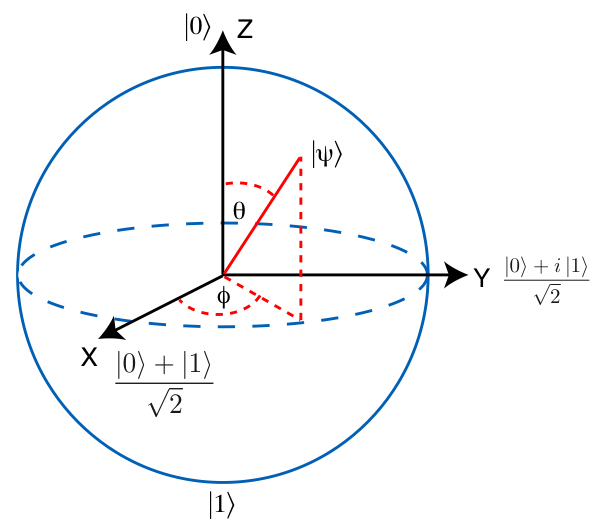 |
|:-----:|
| Bloch Sphere representation of Qubit basis |

<br />

### Theory

Let's start by analysing the `server.py` file that is given to us. The challenge starts in the `challenge(req)` function.

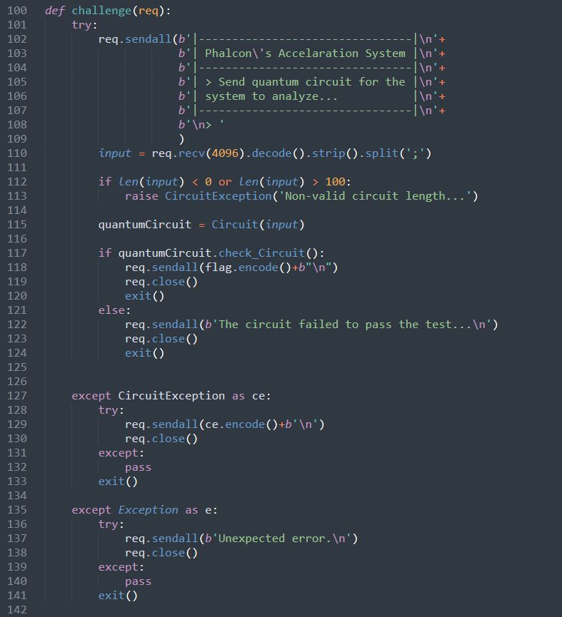

_Phalcon's Acceleration System_... Interesting...

The application takes input and checks that the length of the input is between 0 and 100 characters. After that, a "Quantum Circuit" is created based on our input.

The circuit is then ran through a test-suite function `check_Circuit()`. If the circuit passess the test-suite, a flag is returned.

Let's take a look at the Circuit class:

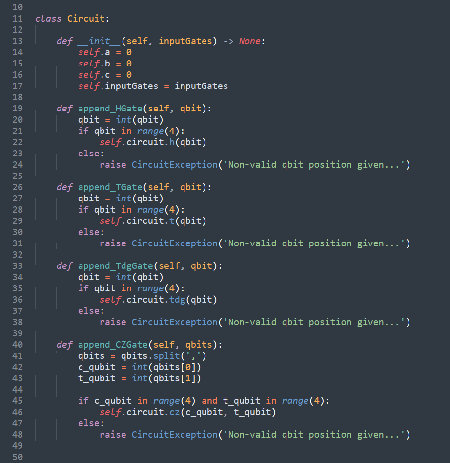

In the `__init__` function we can see that the data we send to the server is the input gates inside a newly created circuit.

After init there are some function definitions for 4 different gates: H, T, Tdg & CZ Gates.

Each of these gates take in a single qubit. What do these gates mean and what do they do?

This is the point where the endless Googling and reading documentation began. Luckily the gate definitions can be found from the qiskit library documentation.

Symbol | Name     | Summary | Documentation
:-----:|:--------:|:-------:|:-------------:
H      | Hadamard | Rotate qubit π/2 degrees in X+Z axis | https://qiskit.org/documentation/stubs/qiskit.circuit.library.HGate.html
T      | T        | Rotate qubit π/8 degrees in Z axis   | https://qiskit.org/documentation/stubs/qiskit.circuit.library.TGate.html
Tdg/T† | TDG/T†   | Rotate qubit π/4 degrees in Z axis   | https://qiskit.org/documentation/stubs/qiskit.circuit.library.TdgGate.html
CZ     | Controlled Pauli-Z | Flips the phase of target qubit if control qubit is in 1 state | https://qiskit.org/documentation/stubs/qiskit.circuit.library.CZGate.html

Also X gates are used in the circuit by the test-suite. X gate simply acts like NOT gate in classical logic. In other words, it inverts the value of the qubit.

After the quantum gates the functions for the circuit generation and the test-suite are defined.

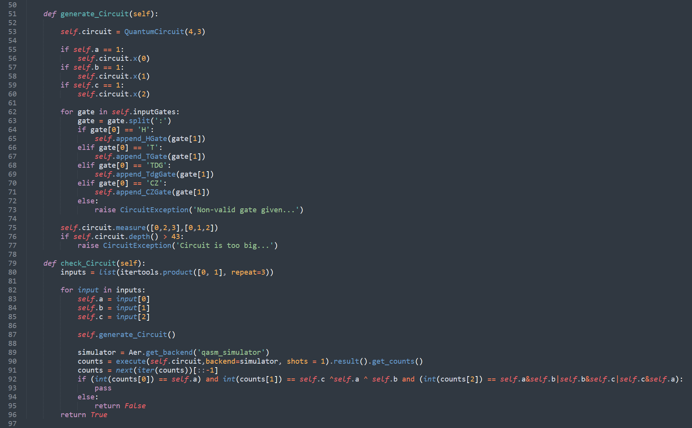

The circuit generation starts with creating a new QuantumCircuit of dimensions 4,3. This means that the circuit takes 4 qubits as input and returns 3 classical bits.

Some X gates are then added to the beginning of the newly created circuit based on the a, b and c values of the test-suite input.

After that the user input is parsed and gates are added accordingly based on our input. We are only limited to the H, T, Tdg and CZ gates.

Some measurement gates are added on line 75 to check the circuits end result. The 2 lists are mapped together to determine the measurement gate position on the circuit. In this case the measurement gates are in the following positions:

* Qubit level 0 (q_0) is measured as the output of the first bit (Bit 0)
* Qubit level 2 (q_2) is measured as the output of the second bit (Bit 1)
* Qubit level 3 (q_3) is measured as the output of the third bit (Bit 2)

In addition to limited ports, the "depth" of our circuit is also limited. On line 76 the server checks that the depth of our circuit is less than 43.

The depth of the circuit is the longest path in the circuit. This means that if we have 3 gates next to eachother, the depth of the circuit is 3. Parallel gates do not increase the depth of the circuit.

Now let's take a look at the tests that are ran against our quantum circuit.

At first the test-suite generates the inputs with itertools. The inputs are as follows:
`[(0, 0, 0), (0, 0, 1), (0, 1, 0), (0, 1, 1), (1, 0, 0), (1, 0, 1), (1, 1, 0), (1, 1, 1)]`

The values in the tuples are then mapped as a, b and c.

So in a nutshell the test-suite systematically checks all possible X gate combinations in the beginning of the circuit.

The quantum simulation is executed on line 90 and the results are saved. This is where the most important check happens.

The server checks the following things from the quantum simulation:
* Bit 0 must be equal to `a`
* Bit 1 must be equal to `c ⊕ a ⊕ b`   (⊕ = XOR logic operation)
* Bit 2 must be equal to `a AND b OR b AND c OR c AND a`

If all of these conditions are met with all of the test scenarios, the flag is returned.

<br />
<br />
<br />

### Example

Now that we have looked at the server in theory level through code analysis, let's walk through it with the help of an example.

In order to run it locally, you need to do some modifications. Create a file called `secrets.py` with the contents of `flag = "HTB{fake_flag_for_testing}"` in the same directory as the `server.py` file.

Let's visualize the circuit in order to make things easier to follow. We can do this by adding `print(self.circuit.draw(output='text'))` to line 76, just before the circuit depth condition.

Let's add that and run the server with some test inputs. The input format is as follows: "GATE:Q_LEVEL;GATE:Q_LEVEL".

| 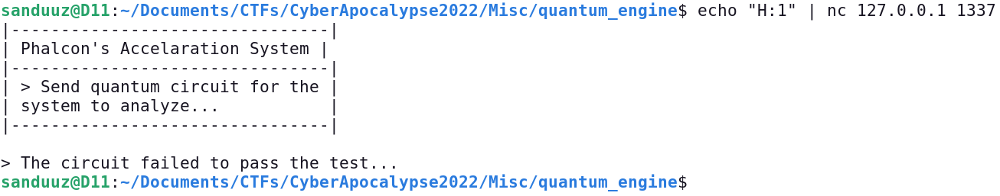 |
|:---------------:|
| Input to server |

| 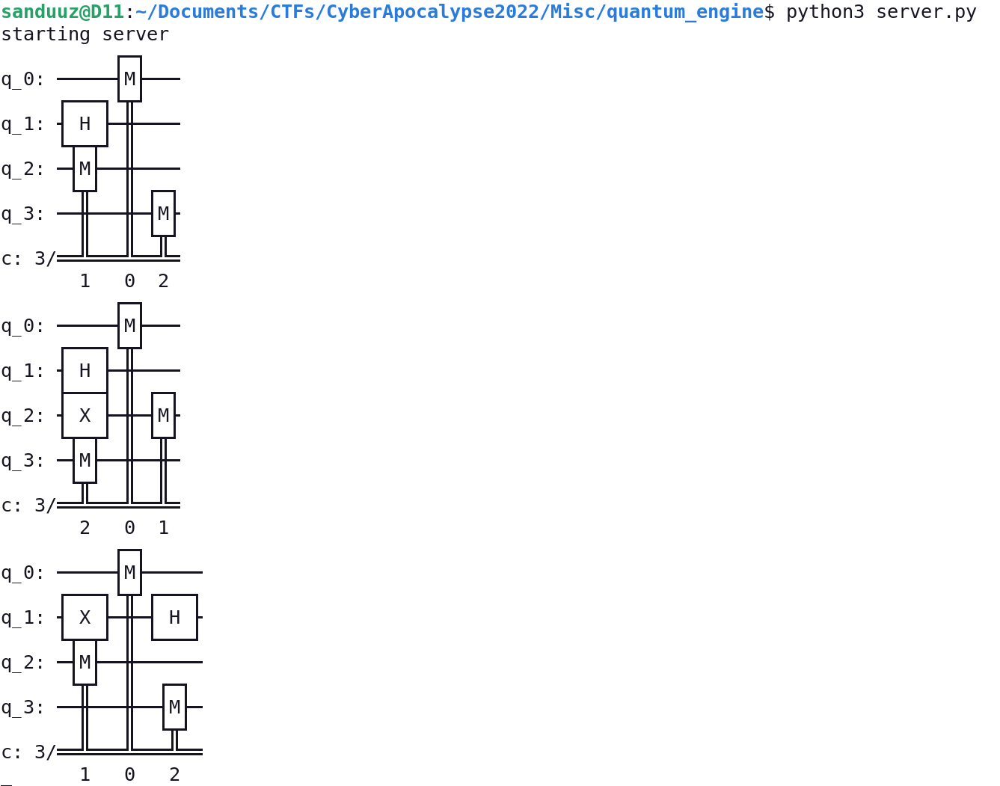 |
|:-------------:|
| Server output |

The circuit was 4 by 3 in dimensions. This can be seen in action with 4 qubit levels as the horizontal lines (q_0, q_1, q_2 & q_3) and 3 classical bits as numbers below the graph.

The numbers below the graph represent the bit number, not the value. So the first bit (bit 0) in the first graph, is actually the one in the middle, bit 1 is the leftmost and bit 2 the rightmost.

Qiskit is reordering the bits in the graph in order to minimize the length of the circuit. This is why the classical bits don't show up in the right order below the graph.

The measurement ports can also be seen in the graph in the hardcoded positions `self.circuit.measure([0,2,3],[0,1,2])` (q_0 -> Bit 0, q_2 -> Bit 1, q_3 -> Bit 2)

Based on our input ("H:1") a new Hadamard (H) gate is created on the q_1 level.

Let's add one more debug print to see what the real result was and what the expected result is. This can be done by adding `print(f"Real Result: {counts} | Expected Result: {self.a}{self.c^self.a^self.b}{self.a&self.b|self.b&self.c|self.c&self.a}")` after line `counts = next(iter(counts))[::-1]`.

Running the server with the same input as before looks like this now:

| 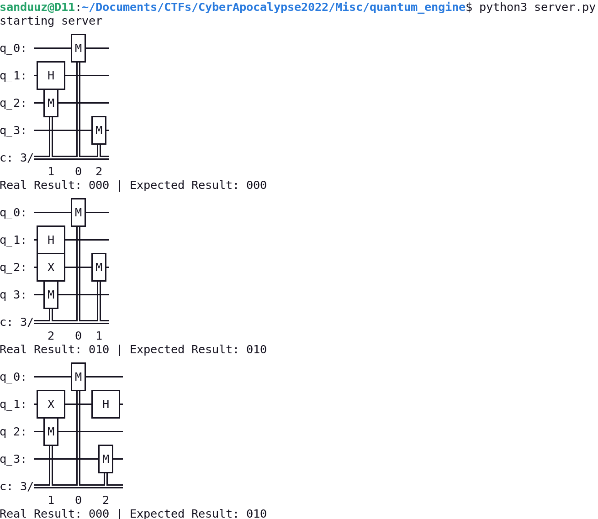 |
|:-------------:|
| Server output |

The gates described in the theory section are quite abstract, so let's take a look at how they perform in action.

We know that the second test scenario is (0, 0, 1), which means that an X gate is added to the q_2 level in the circuit. Due to its simplicity, it is good to choose this test scenario as an baseline for our tests.

I created a small helper script in python to help me fabricate the circuit more easily.

```python
#!/usr/bin/env python3

from pwn import *

HOST = "localhost"
PORT = 1337

conn = remote(HOST, PORT)  # Address and port where server is running.

# Define our input
ports = ["H:1", "H:2"]

# Make script visually pleasing
print(conn.recvuntil(b"> ").decode('utf-8'), end="")
print(conn.recvuntil(b"> ").decode('utf-8'), end="")
print(';'.join(ports))

# Send our input without the last semicolon
conn.sendline(f"{';'.join(ports)}\n".encode("utf-8"))

print(conn.recvall(timeout=5).decode('utf-8'))
```

Now we can just put the ports we want in a list and run the script to fabricate the circuit.

<br />

#### Hadamard

Let's start by sending a single Hadamard gate to q_2 level.

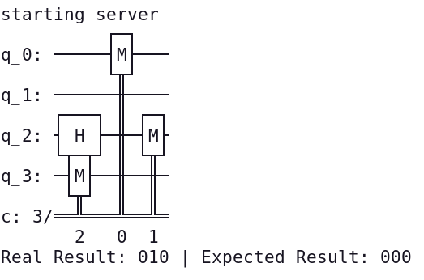

It is failing already in the first scenario where all inputs are 0. Interesting...

Running it again with the exact same input however does not always fail in the same place.

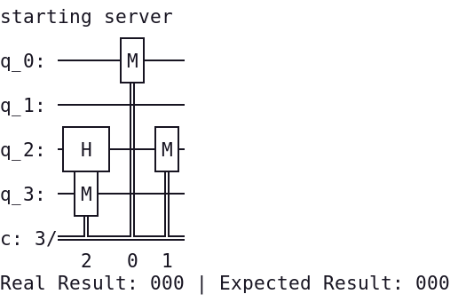

As you can see the exact same circuit now had a different outcome. Instead of real result 010, the real result was 000 this time.

This happens because the Hadamard gate sets the qubit into a state called "superposition". In superposition the qubit is 0 and 1 at the same time. However when the qubit is measured, the superposition collapses  resulting in either 0 or 1.

(You also might have heard of Schrödinger's cat when talking about superpositions. It's a thought experiment where a cat is simultaneously alive and dead.)

In a scenario where 2 Hadamard gates are next to eachother, the gates cancel out eachother resulting in the original value.

This can be verified with our simulation by adding 2 Hadamard gates next to eachother and running the simulation multiple times.

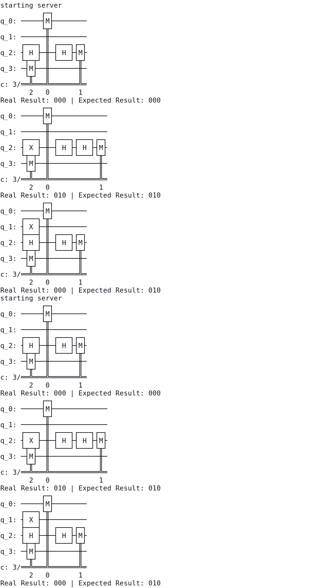

<br />

#### T

Doing the same things with the T gate reveals that the T gate does not change the outcomes by itself. 

This can be demonstrated well with the Bloch sphere representation of qubits.


According to the definition of a T gate, it is equivalent to a π/4 radian rotation about the Z axis. Rotating the Z axis will not change the value of the qubit since it's rotating in place.

However when combined with other gates, the T gate might affect the value of the qubit. For example in the image above in a scenario where the Z axis has been offset from 0, the rotation will affect the end position. 

<br />

#### Tdg

A Tdg gate acts similarly to a T gate. The difference between the gates is that in Tdg gate the rotation is π/2 radians instead of π/4 radians about the Z axis.


<br />

#### CZ

The Controlled-Z (CZ) gate is a bit different than the gates described above, but luckily it is quite simple.

The CZ gate handles 2 different qubits: control- and target-qubit. The control-qubit is sometimes referred to as c-qubit and respectively target-qubit as t-qubit.

The control-qubit is the input value for the gate. If the c-qubit is in the 1 state, the t-qubit's phase is flipped. Otherwise the gate does nothing.

The CZ gate format in this challenge is `CZ:c-qubit,t-qubit`.

The phase shift is invisible, but it can be visualized by adding a Hadamard gate right before and after the CZ gate. This is also known as a Controlled-X/CX/Controlled-NOT/CNOT gate.

<br />

#### CX

We have now built us a new gate that we can use in the circuit. As described above, the CX gate is built of 3 smaller components; The H - CZ - H combination.

Let's run the test suite with the following input: `H:3;CZ:2,3;H:3`

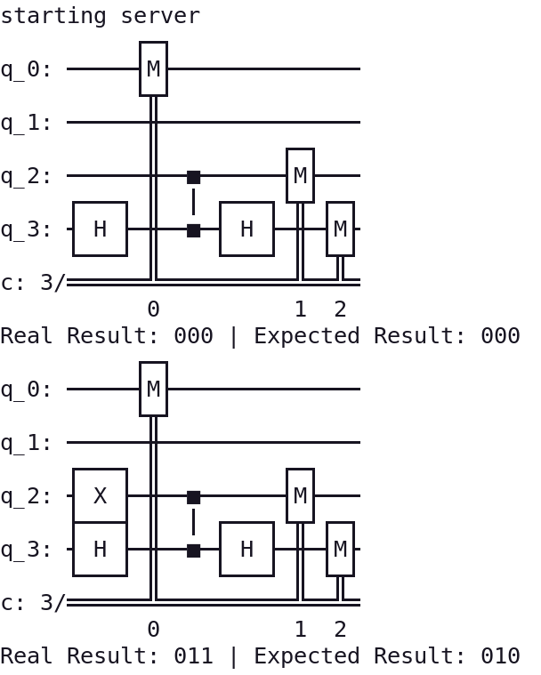

As you can see, the test-suite fails on the second step. The q_3 qubit was evaluated as 1 because of our newly created CX gate.

The value of q_2 is 1 because of the X gate added by the test-suite. This value triggers the phase shift within our CZ gate.

The qubit on q_3 goes through a Hadamard gate rising up into superposition. After the phase of the qubit has been shifted by the CZ gate, it is sent through another Hadamard gate cancelling out the first H gate. Collapsing this qubit from superposition guarantees a flipped qubit. 

Now onto the real challenge.

---

## 2. Step Two - Toffoli?

Let's start the challenge by dividing it into smaller pieces so it is easier to understand. First we need to figure out how we can evaluate the conditions that the test-suite checks.

First I refactored the tinker.py:

```python
#!/usr/bin/env python3

from pwn import *

HOST = "localhost"
PORT = 1337

# Define our input
ports = []

# Define gates
def H(q_level):
    ports.append(f"H:{q_level}")
    
    
def T(q_level):
    ports.append(f"T:{q_level}")
    
    
def Tdg(q_level):
    ports.append(f"TDG:{q_level}")
    
    
def CZ(c_qubit, t_qubit):
    ports.append(f"CZ:{c_qubit},{t_qubit}")
    
    
def CX(c_qubit, t_qubit):
    ports.append(f"H:{t_qubit}")
    ports.append(f"CZ:{c_qubit},{t_qubit}")
    ports.append(f"H:{t_qubit}")
    
    
def create_circuit():
    H(2)
    H(3)
    H(1)


if __name__ == "__main__":
    create_circuit()
   
    conn = remote(HOST, PORT)  # Address and port where server is running.
   
    # Make script visually pleasing
    print(conn.recvuntil(b"> ").decode('utf-8'), end="")
    print(conn.recvuntil(b"> ").decode('utf-8'), end="")
    print(';'.join(ports))

    # Send our input without the last semicolon
    conn.sendline(f"{';'.join(ports)}\n".encode("utf-8"))

    print(conn.recvall(timeout=5).decode('utf-8'))
```

The gates are now defined so we can make chained gates such as CX easier to write in combinations. Now it is possible to just define the gates in order under `create_circuit()`.

Now we can start to tinker with the logic checks. Let's start with a single Hadamard gate on q_1 level.

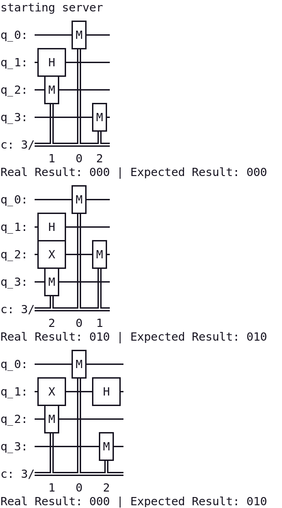

The test-suite fails on the 3rd step where real result was 000, but 010 was expected. Let's see what goes wrong in that check.

The X gate is set on q_1 level, which is not measured. The q_2 level is measured and should be 1. Now that we have the CX gate, we can just take q_1 as input and flip the q_2 value.

Under our `create_circuit()` function we can just put `CX(1,2)`. Let's run tinker.py again and see what happens.

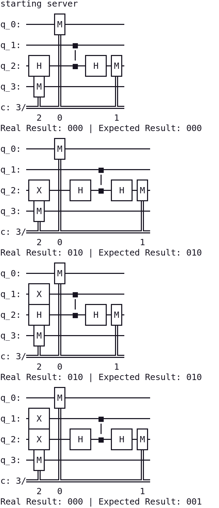

This time we passed check no. 3, but failed on check 4. It looks similar to the problem in check 3. However, if we just add a new CX gate from q_1/q_2 to q_3, the test-suite fails already on step 2.

Also looking at the depth of the circuit already on this step does not look promising. If every operation is performed one at a time, the depth limit is going to be exceeded.

We somehow need to find a way to perform the operations simultaneously. This should be possible according to quantum theory and it is also one of the great differences between quantum and regular computers.

We can achieve this with the help of a [Toffoli gate](https://en.wikipedia.org/wiki/Toffoli_gate).

> In logic circuits, the Toffoli gate (also CCNOT gate), invented by Tommaso Toffoli, is a universal reversible logic gate, which means that any classical reversible circuit can be constructed from Toffoli gates.
> |  |
> |:---:|
> | The Toffoli gate can be constructed from single qubit gates and a minimum of six CNOTs. |
> The *n*-bit Toffoli gate is a generalization of Toffoli gate. It takes *n* bits $x_1$, $x_2$, ..., $x_n$ as inputs and outputs *n* bits. The first *n*−1 output bits are just $x_1$, ..., $x_(n−1)$. The last output bit is ($x_1$ AND ... AND $x_(n−1)$) XOR $x_n$.

Seems to fit our purpose perfectly. Let's see how we can construct a toffoli gate with the given gates H, T, Tdg & CZ.

Judging from the picture it seems that a 3-bit toffoli gate can be constructed with the following combination of gates:
`H:2;CX:1,2;TDG:2;CX:0,2;T:2;CX:1,2;TDG:2;CX:0,2;T:2;H:2;T:1;CX:0,1;TDG:1;T:0;CX:0,1`

The CX gates can be created with the H-CZ-H combination. Let's define the toffoli gate into our `tinker.py`:

```python
def toffoli(first_q_level, second_q_level, third_q_level):
    H(third_q_level)
    CX(second_q_level, third_q_level)
    TDG(third_q_level)
    CX(first_q_level, third_q_level)
    T(third_q_level)
    CX(second_q_level, third_q_level)
    TDG(third_q_level)
    CX(first_q_level, third_q_level)
    T(first_q_level, third_q_level)
    H(third_q_level)
    T(second_q_level)
    CX(first_q_level, second_q_level)
    TDG(second_q_level)
    T(first_q_level)
    CX(first_q_level, second_q_level)
```

Let's send `toffoli(0,1,2)` to the server:

| 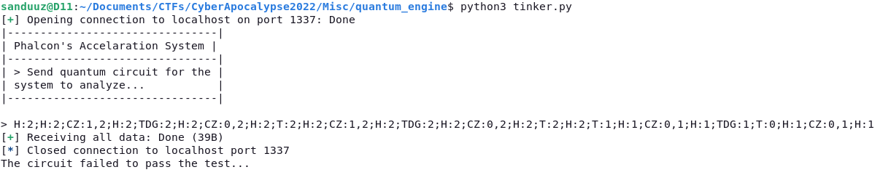 |
|:---------------:|
| Input to server |

| 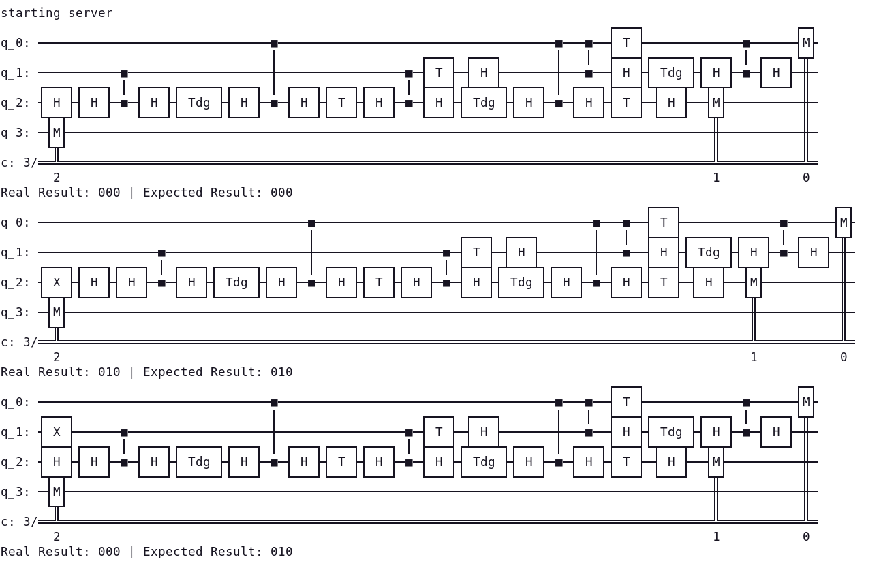 |
|:-------------:|
| Server output |

Seems good! There is a problem though. The 2 Hadamard gates in the beginning cancel out eachother breaking the toffoli gate.

Normally there wouldn't be 2 H gates next to eachother, but in our case it happens because we are constructing the CX gates with the H-CZ-H combination.

Luckily this can be avoided by just removing the first 2 Hadamard gates.

Let's modify `tinker.py` a bit. Let's change all occurences of `';'.join(ports)` to `';'.join(ports[2:])` in order to avoid the dual-Hadamard issue.

The toffoli gate's last output bit is the one XORed, so that needs to be output on level q_3 in order for the XOR test-case to succeed. The toffoli gate can be thought of as XORing the first 2 parameter values together and saving the result to the third parameter. For example `toffoli(x,y,z)` is like XORring x and y together and saving it to z `(z = x ⊕ y)`.

Due to these reasons we need to send 2 toffoli gates to the server: `toffoli(0,1,3)` and `toffoli(1,2,3)`.

Server response: 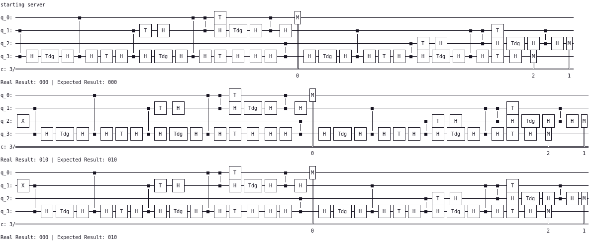

The test-suite fails yet again on the third step. It expected 010, but got 000 instead.

Looking at the second toffoli gate we can see that in the end there is a CX gate flipping our bit from 1 to 0. Luckily this can be easily fixed by just flipping the bit after the second toffoli gate once again.

The bit flip can be achieved by just adding a single CX gate: `CX(1,2)`

Server response: 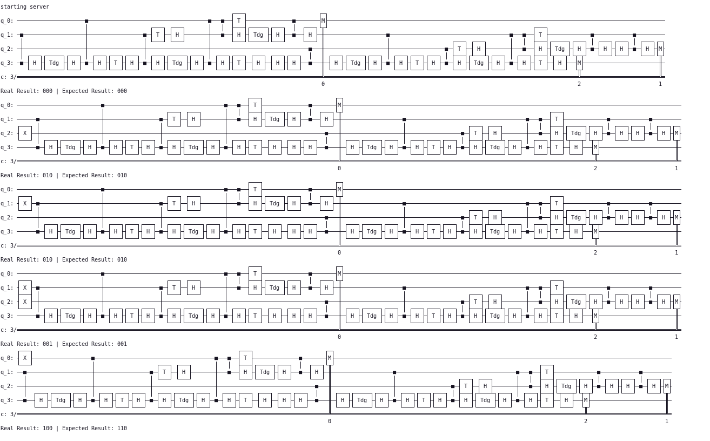

This time the test-suite got up to the fifth step! Expected result was 110, but real result 100. It is yet again the second bit causing the problems. Now there is a dual bit flip in the end of the second toffoli gate.

We can counter this double bit flip by adding yet another CX gate. This time the CX gate has to be added on q_1 level before the second toffoli gate due to the third step in the test-suite.

Let's add `CX(0,1)` after the first toffoli gate and see what happens:

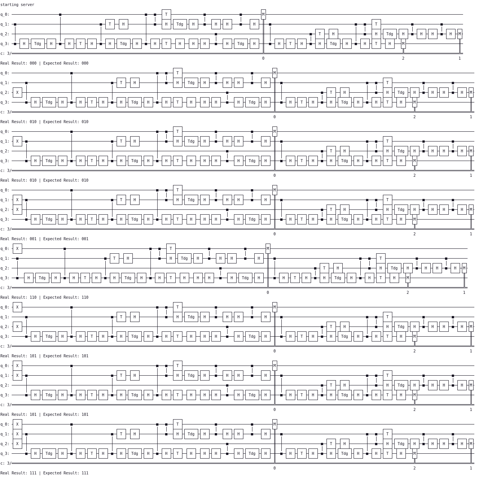

Finally the test-suite seems to pass! Let's see what the `tinker.py` script says:
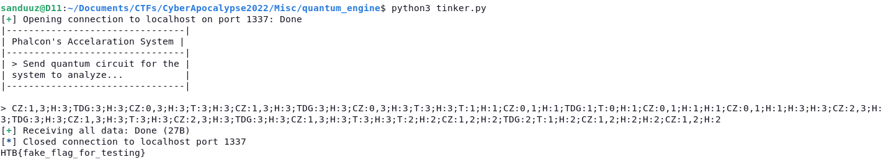

The test-suite really completes without problems and our fake flag is returned.

The final solution gate combination was the following:
```
toffoli(0,1,3)
CX(0,1)
toffoli(1,2,3)
CX(1,2)
```

And the final revision of `tinker.py`:

```python
#!/usr/bin/env python3

from pwn import *

HOST = "localhost"
PORT = 1337

# Define our input
ports = []

# Define gates
def H(q_level):
    ports.append(f"H:{q_level}")


def T(q_level):
    ports.append(f"T:{q_level}")


def TDG(q_level):
    ports.append(f"TDG:{q_level}")


def CZ(c_qubit, t_qubit):
    ports.append(f"CZ:{c_qubit},{t_qubit}")


def CX(c_qubit, t_qubit):
    ports.append(f"H:{t_qubit}")
    ports.append(f"CZ:{c_qubit},{t_qubit}")
    ports.append(f"H:{t_qubit}")


def toffoli(first_q_level, second_q_level, third_q_level):
    H(third_q_level)
    CX(second_q_level, third_q_level)
    TDG(third_q_level)
    CX(first_q_level, third_q_level)
    T(third_q_level)
    CX(second_q_level, third_q_level)
    TDG(third_q_level)
    CX(first_q_level, third_q_level)
    T(third_q_level)
    H(third_q_level)
    T(second_q_level)
    CX(first_q_level, second_q_level)
    TDG(second_q_level)
    T(first_q_level)
    CX(first_q_level, second_q_level)


def create_circuit():
    toffoli(0,1,3)
    CX(0,1)
    toffoli(1,2,3)
    CX(1,2)
    
    
if __name__ == "__main__":
    create_circuit()
    
    conn = remote(HOST, PORT)  # Address and port where server is running.
    
    # Make script visually pleasing
    print(conn.recvuntil(b"> ").decode('utf-8'), end="")
    print(conn.recvuntil(b"> ").decode('utf-8'), end="")
    print(';'.join(ports[2:]))
    
    # Send our input without the last semicolon
    conn.sendline(f"{';'.join(ports[2:])}\n".encode("utf-8"))
    
    print(conn.recvall(timeout=5).decode('utf-8'))
```

Now we can just run this script agains the real backend to get the flag:

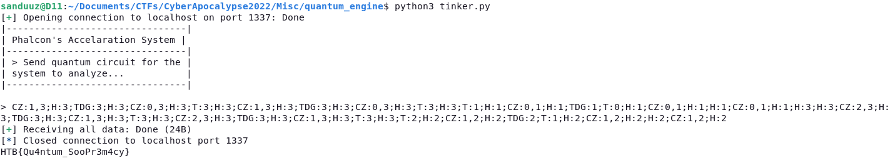
> Note: The script is ran against localhost with the real flag since the challenge infrastructure was already down when writing this writeup.

<br />

<details>
    <summary>Flag:</summary>
    HTB{Qu4ntum_SooPr3m4cy}
</details>

<br />

### Summary

The challenge was very interesting and taught me lots of things. It was indeed quite hard without previous knowledge of quantum theory/mechanics, but it was very satisfying to solve it.