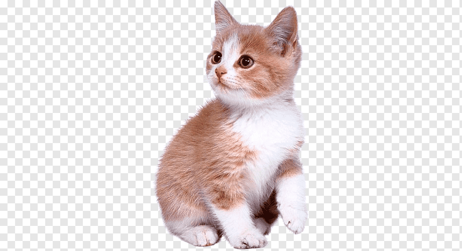

> Look at this cute kitten
> |  |
> |:---:|
> | The Toffoli gate can be constructed from single qubit gates and a minimum of six CNOTs. |
> The *n*-bit Toffoli gate is a generalization of Toffoli gate. It takes *n* bits $x_1$, $x_2$, ..., $x_n$ as inputs and outputs *n* bits. The first *n*−1 output bits are just $x_1$, ..., $x_(n−1)$. The last output bit is ($x_1$ AND ... AND $x_(n−1)$) XOR $x_n$.
